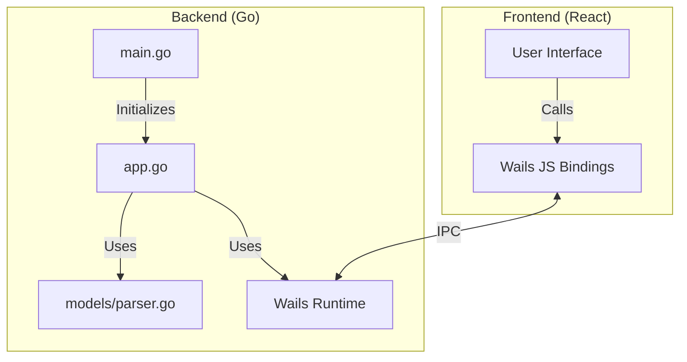
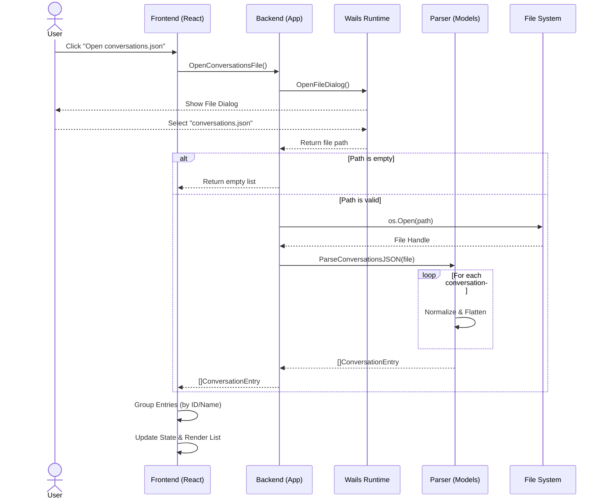

# System Architecture

## Overview
`chat-explorer` is a desktop application built using the [Wails](https://wails.io/) framework (v2). It combines a Go backend for file handling and data processing with a modern React frontend for the user interface.

## System Design

## Backend (Go)

The backend is responsible for:
1.  **Application Lifecycle**: Managed by `main.go`, which initializes the Wails application with assets and bindings.
2.  **Native Integration**: `app.go` provides methods accessible to the frontend (via Wails bindings) to trigger native file dialogs and load files from the filesystem.
3.  **Data Processing**:
    *   **`models/` Package**: Contains the domain models and business logic.
    *   **Parsing Logic**: `models/parser.go` implements a robust JSON parser designed to ingest conversation exports (e.g., from LLM chat interfaces). It handles complex nested structures and normalizes them into a simplified `ConversationEntry` format for the frontend.

### Key Components
*   **`App` Struct**: The main application controller. Methods exported on this struct are automatically bound to the frontend.
    *   `OpenConversationsFile()`: Opens a native system dialog for the user to select a JSON file.
    *   `LoadConversationsFromPath(path)`: Reads and parses the file at the given path.
*   **`ConversationEntry` Struct**: The normalized data structure sent to the frontend.
    *   `ConversationID`: Unique identifier.
    *   `ConversationName`: Title of the conversation.
    *   `Speaker`: Who sent the message (e.g., "human", "assistant").
    *   `Message`: The content of the message.

## Frontend (TypeScript + React)

The frontend is a Single Page Application (SPA) served by Wails.

### Technology Stack
*   **Framework**: React 18
*   **Build Tool**: Vite
*   **Language**: TypeScript
*   **UI Component Library**: Material UI (@mui/material)
*   **Testing**: Vitest + React Testing Library

### Key Components
*   **`App.tsx`**: Main component that manages state and renders the UI.
*   **`models/conversations.ts`**: Contains the logic to group flat `ConversationEntry` items into `ConversationThread` objects, handling duplicate names and merging messages.

### Interaction
The frontend communicates with the Go backend asynchronously through the Wails runtime.
*   **`wailsjs/`**: Auto-generated TypeScript bindings for the Go methods (e.g., `OpenConversationsFile`). This ensures type safety between the backend and frontend.

## User Journey (Data Flow)

The following sequence diagram illustrates the flow when a user loads a conversation file.

