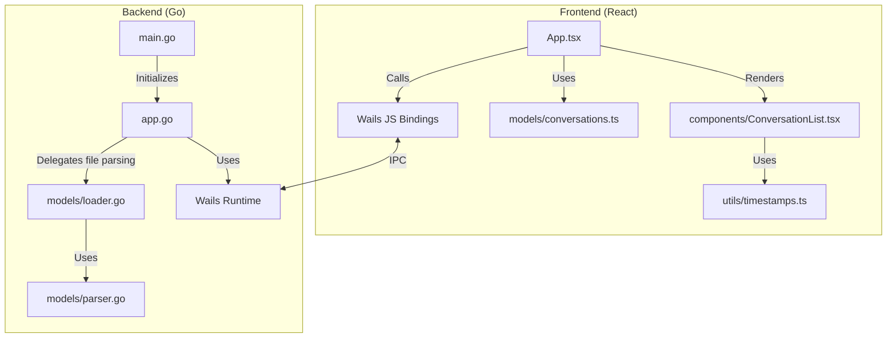
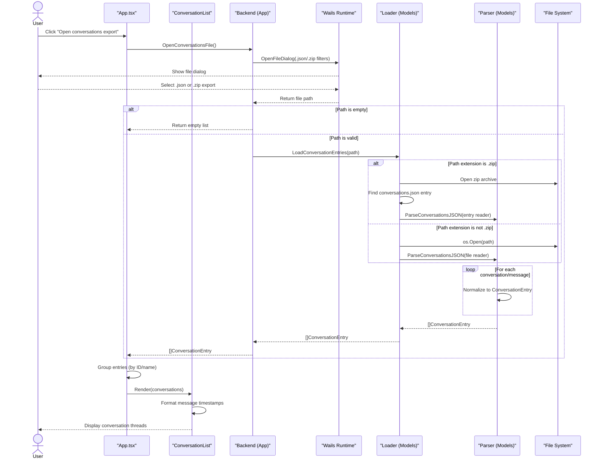

# System Architecture

## Overview
`chat-explorer` is a desktop application built with [Wails](https://wails.io/) (v2), a Go backend, and a React frontend.  
The current MVP supports loading conversations from either:
- a direct `conversations.json` file, or
- a `.zip` export that contains `conversations.json`.

`memories.json` and `projects.json` are currently ignored by design for v3 MVP.

## Authoritative Export Contract
The parser contract is anchored to the real export sample provided by the user (conversation UUID `79b16c43-8e2e-4cee-8015-d652d0ad6423`).

### Archive-level fields observed
- zip entries may include:
  - `conversations.json` (required for MVP parsing)
  - `memories.json` (ignored for now)
  - `projects.json` (ignored for now)

### Conversation-level fields observed
- `uuid` (used as `ConversationID`)
- `name` (used as `ConversationName`)
- `chat_messages` (iterated)
- `summary`, `created_at`, `updated_at`, `account` (currently ignored by parser)

### Message-level fields observed
- `sender` (used as `Speaker`, fallback to `"unknown"` when empty)
- `text` and `content` (used to compute `Message`; `text` takes precedence)
- `created_at` (used as `MessageTimestamp`)
- `updated_at`, `attachments`, `files`, `uuid` (currently ignored by parser)

### Output contract sent to frontend
- `conversationId`
- `conversationName`
- `speaker`
- `message`
- `messageTimestamp`

## System Design

## Backend (Go)

The backend is responsible for:
1. **Application lifecycle**: managed by `main.go`, which initializes the Wails app with assets and bindings.
2. **Native integration**: `app.go` exposes methods to open the native file picker and load selected export paths.
3. **Domain data processing** (`models/`):
   - `models/loader.go`: chooses ingestion strategy (`.zip` vs non-zip), locates `conversations.json` within archives, and delegates JSON parsing.
   - `models/parser.go`: flattens conversation/message structures into normalized `ConversationEntry` rows.

### Key Components
- **`App` struct** (`app.go`):
  - `OpenConversationsFile()`: opens a native dialog filtered for `.json` and `.zip`.
  - `LoadConversationsFromPath(path)`: delegates loading/parsing to `models.LoadConversationEntries(path)`.
- **`LoadConversationEntries(path)`** (`models/loader.go`):
  - Validates input path.
  - Reads a zip archive when extension is `.zip` and extracts `conversations.json`.
  - Otherwise parses the target file as JSON export input.
- **`ConversationEntry` struct** (`models/parser.go`):
  - `ConversationID`
  - `ConversationName`
  - `Speaker`
  - `Message`
  - `MessageTimestamp`

## Frontend (TypeScript + React)

The frontend is an SPA served by Wails.

### Technology Stack
- React 18
- Vite
- TypeScript
- Material UI (`@mui/material`)
- Vitest + React Testing Library

### Key Components
- `App.tsx`: manages loading state and requests export data via `OpenConversationsFile()`.
- `models/conversations.ts`: groups flat entries into conversation threads.
- `components/ConversationList.tsx`: renders expandable threads/messages.
- `utils/timestamps.ts`: formats timestamps into local display format.

## User Journey (Data Flow)

