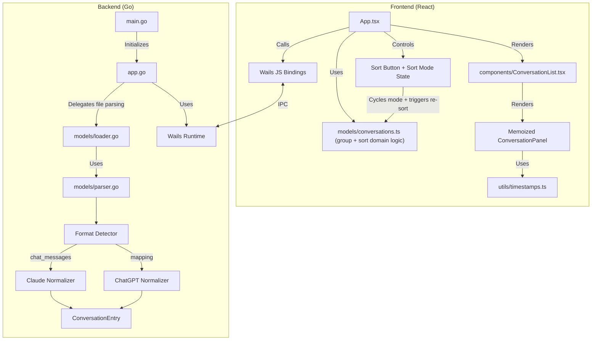
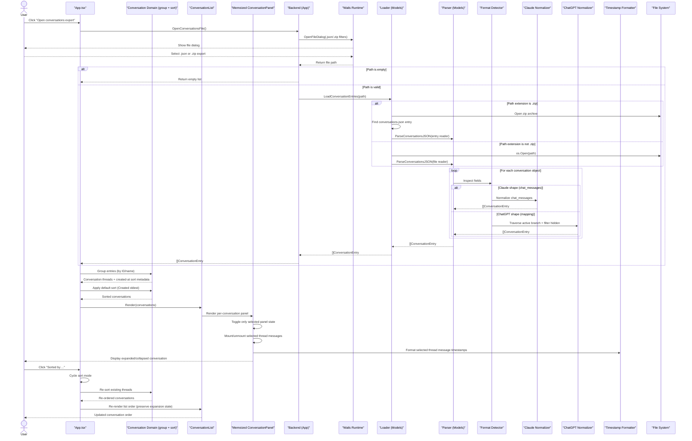

# System Architecture

## Overview
`chat-explorer` is a desktop application built with [Wails](https://wails.io/) (v2), a Go backend, and a React frontend.  
The current MVP supports loading conversations from either:
- a direct `conversations.json` file, or
- a `.zip` export that contains `conversations.json`.

After import, the frontend groups message rows into conversation threads and supports a user-controlled sort cycle:
- `Sorted by Created (oldest)` (default)
- `Sorted by Created (newest)`
- `Sorted by Name (A-Z)`
- `Sorted by Name (Z-A)`

Each conversation row also displays a formatted conversation created date:
- `(YYYY-MM-DD HH:MM Timezone)`

The parser supports both known `conversations.json` schemas:
- Claude export format (`uuid`, `name`, `chat_messages`)
- ChatGPT export format (`conversation_id`, `title`, `mapping`, `current_node`)

`memories.json` and `projects.json` are ignored by design for the current scope.

## Authoritative Export Contract
The parser contract is anchored to real examples under `docs/`:
- Claude style sample (`docs/requirements-v3.md` + fixtures in `models/testdata/`)
- ChatGPT style sample (`docs/chatgpt-conversations.json`, `docs/requirements-v4.md`)

### Archive-level fields observed
- zip entries may include:
  - `conversations.json` (required for MVP parsing)
  - `memories.json` (ignored for now)
  - `projects.json` (ignored for now)

### Conversation-level fields observed
#### Claude format
- `uuid` (used as `ConversationID`)
- `name` (used as `ConversationName`)
- `chat_messages` (iterated)
- `created_at` (used as conversation-level created timestamp when available)
- `summary`, `updated_at`, `account` (currently ignored by parser)

#### ChatGPT format
- `conversation_id` (used as `ConversationID`)
- `title` (used as `ConversationName`)
- `current_node` (used to pick the active branch)
- `mapping` (message tree keyed by node id)
- `create_time` (Unix seconds, used as conversation-level created timestamp)
- `update_time` (Unix seconds, used for message timestamp fallback)

### Message-level fields observed
#### Claude format
- `sender` (used as `Speaker`, fallback to `"unknown"` when empty)
- `text` and `content` (used to compute `Message`; `text` takes precedence)
- `created_at` (used as `MessageTimestamp`)
- `updated_at`, `attachments`, `files`, `uuid` (currently ignored by parser)

#### ChatGPT format
- `message.author.role` (used as `Speaker`, fallback to `"unknown"`)
- `message.content.parts` (joined into `Message`, fallback to `message.content.text`)
- `message.create_time` (Unix seconds converted to ISO-8601 UTC)
- `message.metadata.is_visually_hidden_from_conversation` (hidden messages filtered out)
- `message.channel`, `message.author.name`, tool metadata (currently informational only)

### Normalization rules
- Parser detects format per conversation object by presence of `mapping`.
- ChatGPT traversal follows the `current_node` ancestry path (active branch); if unavailable, traversal falls back to root-based graph walk.
- Empty/blank messages are skipped.
- Hidden ChatGPT messages are skipped.
- Conversation created timestamp fallback:
  - Claude: `conversation.created_at` -> oldest message `created_at`.
  - ChatGPT: `conversation.create_time` -> oldest parsed message timestamp on selected branch.
- ChatGPT timestamp fallback order: message `create_time` -> ancestor `create_time` -> conversation `create_time` -> conversation `update_time`.

### Output contract sent to frontend
- `conversationId`
- `conversationName`
- `conversationCreatedAt`
- `speaker`
- `message`
- `messageTimestamp`

## System Design

```mermaid
graph TD
    subgraph "Frontend (React)"
        AppC["App.tsx"]
        SortUI["Sort Button + Sort Mode State"]
        Bindings["Wails JS Bindings"]
        Logic["models/conversations.ts (group + sort domain logic)"]
        CompList["components/ConversationList.tsx"]
        CompPanel["Memoized ConversationPanel"]
        Utils["utils/timestamps.ts"]
    end

    subgraph "Backend (Go)"
        Main["main.go"]
        AppGo["app.go"]
        Loader["models/loader.go"]
        Parser["models/parser.go"]
        Detector["Format Detector"]
        ClaudeNorm["Claude Normalizer"]
        ChatGPTNorm["ChatGPT Normalizer"]
        EntryModel["ConversationEntry"]
        Runtime["Wails Runtime"]
    end

    AppC -->|Calls| Bindings
    AppC -->|Controls| SortUI
    AppC -->|Uses| Logic
    AppC -->|Renders| CompList
    CompList -->|Renders| CompPanel
    CompPanel -->|Uses| Utils
    SortUI -->|Cycles mode + triggers re-sort| Logic
    Bindings <-->|IPC| Runtime
    Main -->|Initializes| AppGo
    AppGo -->|Uses| Runtime
    AppGo -->|Delegates file parsing| Loader
    Loader -->|Uses| Parser
    Parser --> Detector
    Detector -->|chat_messages| ClaudeNorm
    Detector -->|mapping| ChatGPTNorm
    ClaudeNorm --> EntryModel
    ChatGPTNorm --> EntryModel
```

## Backend (Go)

The backend is responsible for:
1. **Application lifecycle**: managed by `main.go`, which initializes the Wails app with assets and bindings.
2. **Native integration**: `app.go` exposes methods to open the native file picker and load selected export paths.
3. **Domain data processing** (`models/`):
   - `models/loader.go`: chooses ingestion strategy (`.zip` vs non-zip), locates `conversations.json` within archives, and delegates JSON parsing.
   - `models/parser.go`: detects export format and normalizes Claude/ChatGPT conversations into `ConversationEntry` rows.

### Key Components
- **`App` struct** (`app.go`):
  - `OpenConversationsFile()`: opens a native dialog filtered for `.json` and `.zip`.
  - `LoadConversationsFromPath(path)`: delegates loading/parsing to `models.LoadConversationEntries(path)`.
- **`LoadConversationEntries(path)`** (`models/loader.go`):
  - Validates input path.
  - Reads a zip archive when extension is `.zip` and extracts `conversations.json`.
  - Otherwise parses the target file as JSON export input.
- **`ParseConversationsJSON(reader)`** (`models/parser.go`):
  - Decodes top-level array.
  - Detects format per record (`mapping` vs non-`mapping`).
  - Applies format-specific normalization and filtering.
- **`ConversationEntry` struct** (`models/parser.go`):
  - `ConversationID`
  - `ConversationName`
  - `ConversationCreatedAt`
  - `Speaker`
  - `Message`
  - `MessageTimestamp`

## Frontend (TypeScript + React)

The frontend is an SPA served by Wails.

### Technology Stack
- React 18
- Vite
- TypeScript
- Material UI (`@mui/material`)
- Vitest + React Testing Library

### Key Components
- `App.tsx`: manages loading state, the active sort mode, and the sort-cycle button (`Sorted by ...`).
- `models/conversations.ts`: groups flat entries into conversation threads, derives `conversationCreatedAt` for each thread, and applies deterministic sorting with explicit tie-breakers.
- `components/ConversationList.tsx`: renders thread summaries (name, message count, UUID, created date) and delegates each thread to a memoized panel component so toggling one thread does not re-render all expanded threads.
- `utils/timestamps.ts`: formats message timestamps (second precision) and conversation summary timestamps (minute precision) into local display format.

### Frontend Performance Note
- Conversation grouping precomputes sortable metadata (`conversationCreatedAt`, parsed epoch milliseconds, raw name key), so sort operations avoid repeated timestamp parsing.
- Sorting uses deterministic comparators (including UTF-8-safe lexical comparison through `Intl.Collator`) and explicit tie-breakers (`name` then `conversationId`).
- `ConversationList` uses stable panel keys and resets expansion state only when a new conversation dataset is loaded (not when sort mode changes). This preserves expanded/collapsed state while reordering.
- Per-panel memoization and localized toggle state updates keep collapse/expand interactions low-latency by limiting re-render scope.

## User Journey (Data Flow)

```mermaid
sequenceDiagram
    actor User
    participant UI as "App.tsx"
    participant Domain as "Conversation Domain (group + sort)"
    participant List as "ConversationList"
    participant Panel as "Memoized ConversationPanel"
    participant Backend as "Backend (App)"
    participant Runtime as "Wails Runtime"
    participant Loader as "Loader (Models)"
    participant Parser as "Parser (Models)"
    participant Detect as "Format Detector"
    participant Claude as "Claude Normalizer"
    participant ChatGPT as "ChatGPT Normalizer"
    participant Utils as "Timestamp Formatter"
    participant FS as "File System"

    User->>UI: Click "Open conversations export"
    UI->>Backend: OpenConversationsFile()
    Backend->>Runtime: OpenFileDialog(.json/.zip filters)
    Runtime-->>User: Show file dialog
    User-->>Runtime: Select .json or .zip export
    Runtime-->>Backend: Return file path

    alt Path is empty
        Backend-->>UI: Return empty list
    else Path is valid
        Backend->>Loader: LoadConversationEntries(path)
        alt Path extension is .zip
            Loader->>FS: Open zip archive
            Loader->>Loader: Find conversations.json entry
            Loader->>Parser: ParseConversationsJSON(entry reader)
        else Path extension is not .zip
            Loader->>FS: os.Open(path)
            Loader->>Parser: ParseConversationsJSON(file reader)
        end
        loop For each conversation object
            Parser->>Detect: Inspect fields
            alt Claude shape (chat_messages)
                Detect->>Claude: Normalize chat_messages
                Claude-->>Parser: []ConversationEntry
            else ChatGPT shape (mapping)
                Detect->>ChatGPT: Traverse active branch + filter hidden
                ChatGPT-->>Parser: []ConversationEntry
            end
        end
        Parser-->>Loader: []ConversationEntry
        Loader-->>Backend: []ConversationEntry
        Backend-->>UI: []ConversationEntry
    end

    UI->>Domain: Group entries (by ID/name)
    Domain-->>UI: Conversation threads + created-at sort metadata
    UI->>Domain: Apply default sort (Created oldest)
    Domain-->>UI: Sorted conversations
    UI->>List: Render(conversations)
    List->>Panel: Render per-conversation panel
    Panel->>Panel: Toggle only selected panel state
    Panel->>Panel: Mount/unmount selected thread messages
    Panel->>Utils: Format selected thread message timestamps
    Panel-->>User: Display expanded/collapsed conversation

    User->>UI: Click "Sorted by ..."
    UI->>UI: Cycle sort mode
    UI->>Domain: Re-sort existing threads
    Domain-->>UI: Re-ordered conversations
    UI->>List: Re-render list order (preserve expansion state)
    List-->>User: Updated conversation order
```
